# Architecture Decision Record — Jugalbandi

**Version:** 1.0
**Date:** February 28, 2026
**Authors:** Aman & Mukta (with Claude as development partner)
**Status:** Pre-Development — All Decisions Resolved
**Companion docs:** [Ideation Document v2](ideation-document-v2.md) (spec) | [Development Roadmap](development-roadmap.md) (timeline)

---

## How to Read This Document

This ADR captures every architectural decision made during pre-development across 8 domains. Each section contains:

- **Context** — why the decision space exists
- **Decision table** — what was decided, what was rejected, and why
- **Mermaid diagrams** — visual architecture where structure matters
- **Source references** — traceability to research briefs [B1]–[B6]

Research brief key:

| Tag | Brief | File |
|-----|-------|------|
| [B1] | Psychological Warfare Against Procrastination | `docs/research/compass_artifact_wf-ddd161ab*.md` |
| [B2] | Anti-AI-Slop Design System | `docs/research/compass_artifact_wf-95b4bb55*.md` |
| [B3] | Gamification Engine | `docs/research/compass_artifact_wf-6fa47172*.md` |
| [B4] | Adaptive AI Personality (Kira) | `docs/research/compass_artifact_wf-f3095f8c*.md` |
| [B5] | PWA Push Notifications | `docs/research/compass_artifact_wf-ad74123c*.md` |
| [B6] | Competitive Analysis & Strategic Differentiation | `docs/research/compass_artifact_wf-3cf112c6*.md` |

---

## Table of Contents

1. [System Architecture Overview](#1-system-architecture-overview)
2. [Frontend Stack](#2-frontend-stack)
3. [Design System](#3-design-system)
4. [Backend & Database](#4-backend--database)
5. [AI Integration — Kira](#5-ai-integration--kira)
6. [Gamification & Scoring](#6-gamification--scoring)
7. [Punishment Date Engine](#7-punishment-date-engine)
8. [Psychology & Safety](#8-psychology--safety)
9. [Push Notifications](#9-push-notifications)
10. [Onboarding & Mascot](#10-onboarding--mascot)
- [Appendix A: Decision Index](#appendix-a-decision-index)
- [Appendix B: Research Brief Cross-Reference](#appendix-b-research-brief-cross-reference)
- [Appendix C: Glossary](#appendix-c-glossary)

---

## 1. System Architecture Overview

**Context:** Jugalbandi is a couples accountability app for exactly 2 users. The architecture must support real-time sync, push notifications, AI integration, and offline capability — all without a custom backend server. The 2-user constraint means enterprise-scale concerns (sharding, load balancing, multi-tenancy) are irrelevant, and the entire system can run within free or near-free tiers of managed services.

### Decisions

| Decision | Alternatives Considered | Rationale | Status |
|----------|------------------------|-----------|--------|
| Progressive Web App (PWA) | Native iOS + Android, React Native, Flutter | Single codebase, no app store gatekeeping, push notifications via Web Push (iOS 16.4+), installable to home screen. 2 users don't justify the overhead of native development. [B5, B6] | Accepted |
| Supabase as sole backend | Firebase, custom Node/Express, AWS Amplify | PostgreSQL (not NoSQL), built-in Auth + Realtime + Edge Functions + Vault + pg_cron. No vendor lock-in on data layer. Free tier covers 2 users comfortably. Firebase rejected for NoSQL lock-in. Custom backend rejected as over-engineering. [B4, B5] | Accepted |
| 2-user hard constraint | Multi-user with couples mode, expandable architecture | The app is purpose-built for exactly one couple. Garcia & Tor's N-effect research shows competitive motivation peaks in a dyad. Every table, policy, and feature is optimized for 2. Designing for expansion would dilute the product. [B1, B6] | Accepted |
| Claude API for AI | OpenAI GPT, local LLM, no AI | Claude demonstrates stronger personality consistency and nuanced reasoning for the "AI judge" use case. Edge Functions call Claude directly — no middleware needed. [B4, B6] | Accepted |

### System Context Diagram

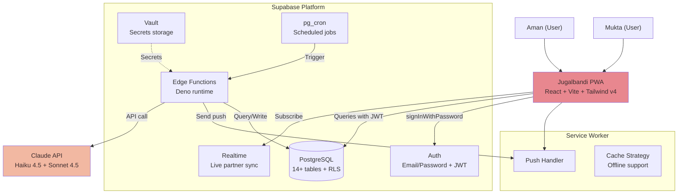

**Sources:** [B1] §Social Comparison/N-Effect, [B4] §Architecture, [B5] §Web Push, [B6] §Market Gaps

---

## 2. Frontend Stack

**Context:** The frontend must deliver a kawaii, warm aesthetic at native-app performance levels. It needs to work as an installable PWA with push notifications, offline support, and real-time partner sync. The founders explicitly reject generic AI-generated UI — every technology choice must enable distinctive visual identity.

### Decisions

| Decision | Alternatives Considered | Rationale | Status |
|----------|------------------------|-----------|--------|
| React + Vite | Next.js, Remix, SvelteKit, plain Vite | Fast HMR, tree-shaking, mature ecosystem. SSR is unnecessary for a 2-user PWA with no SEO needs. Next.js/Remix add complexity without benefit. [B6] | Accepted |
| Tailwind CSS v4 | CSS Modules, Styled Components, Vanilla Extract | Rapid iteration, design token system via theme config, utility-first matches vibe-coding approach. Tailwind v4 supports CSS-first configuration. [B2] | Accepted |
| vite-plugin-pwa | Custom service worker, Workbox directly | Generates manifest, precaches assets, handles service worker lifecycle. Reduces boilerplate for PWA setup. [B5] | Accepted |
| Self-hosted fonts via @fontsource-variable | Google Fonts CDN, system fonts | CDN introduces external dependency and privacy concerns. Variable fonts (single 40–80KB file) replace 5 static weights (150–250KB). Subsetting with `pyftsubset` yields 60–70% size reduction. Service worker caches fonts. [B2] | Accepted |
| Baloo 2 + Nunito + Comfortaa ("Bubble Tea" system) | Josefin Sans + Quicksand ("Matcha Latte"), Shantell Sans + Lexend ("Love Letter") | Baloo 2 has native Devanagari support (Hinglish compatibility), round kawaii letterforms, extreme weight contrast (400–800). Nunito is rounded sans-serif for readable body text. Comfortaa for accent numbers (streak counters). All three are variable fonts. [B2] | Accepted |
| dotLottie format with @lottiefiles/dotlottie-react | Raw Lottie JSON, Rive, CSS-only animations | dotLottie compresses 80–90% vs JSON. WebAssembly runtime for performance. Lottie Slots enable runtime theme switching. CSS handles simple transitions; Lottie handles character animations and celebrations. [B2] | Accepted |
| Hugeicons (Stroke Rounded, 1.5px) | Lucide, Heroicons, Phosphor | 46,000+ icons, consistent kawaii-compatible rounded style. Free tier covers needs (4,600 icons). Scoped packages enable tree-shaking (~0.75KB per icon). [B2] | Accepted |
| Dark mode via `prefers-color-scheme` + manual toggle | Light-only, dark-only | Three warm-tinted dark modes (Midnight, Evening, Fireside) — never neutral gray or blue-gray. CSS variables on `data-theme` attribute. [B2] | Accepted |
| Banned font list enforced | No restrictions | Inter, Roboto, DM Sans, Poppins, Open Sans, Montserrat, Space Grotesk, Lato, and all system fonts are banned. These are markers of generic AI-generated UI. [B2] | Accepted |

### Frontend Component Tree

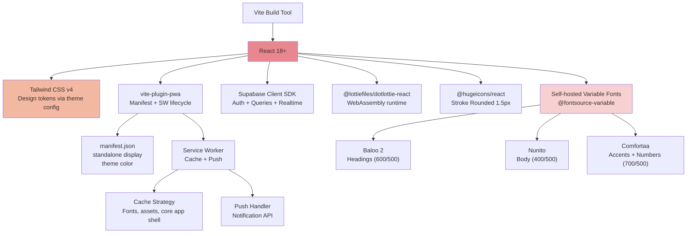

**Sources:** [B2] §Typography, §Animation, §Icons, §Anti-Slop, [B5] §PWA, [B6] §Design Benchmarks

---

## 3. Design System

**Context:** The founders explicitly reject the "AI slop" aesthetic — the generic, cool-toned, rounded-corner-on-everything look that pervades AI-generated UIs. The design system must feel handcrafted, warm, and kawaii while maintaining WCAG AA accessibility. An 18-point anti-slop checklist gates every screen: if 3+ red flags trigger, the design is redone. [B2]

### Decisions

| Decision | Alternatives Considered | Rationale | Status |
|----------|------------------------|-----------|--------|
| Warm color system (3 named palettes) | Material Design colors, Shadcn defaults, cool-toned palettes | Three complete palettes — Strawberry Milk (default), Matcha Latte, Honey Biscuit — all sharing a warm undertone rule: no cool grays, no blue-tinted darks, no pure black (`#000`) or white (`#FFF`). Cream backgrounds (`#FFF8F3`), warm dark mode (`#1E1618`). [B2] | Accepted |
| 18-point anti-slop checklist | No checklist, standard design review | Codified list of red flags: Inter as sole font, `#6366F1` indigo primary, purple-to-blue gradients, uniform `rounded-lg`, identical `shadow-sm`, Corporate Memphis illustrations, etc. If 3+ trigger, the design is redone. [B2] | Accepted |
| Kawaii "Pastel Kawaii" sub-genre | Material minimalism, skeuomorphic, flat design | Rilakkuma/Sumikko Gurashi register. Corner radii 20–24px for cards, 9999px (pill) for buttons. Warm dark brown `#3D2C2E` instead of black for outlines. Spacing 1.5–2x Material Design. [B2] | Accepted |
| Bouncy easing as signature | Standard ease-out, linear | `cubic-bezier(0.34, 1.56, 0.64, 1)` used consistently across all interactive animations. This single timing function creates the "squishy" feel. [B2] | Accepted |
| Component specs with exact values | Generic component library (Shadcn, Radix) | Pill buttons (9999px radius, 14px 28px padding, bottom ledge shadow), cards (20px radius, 2px colored border, warm shadow), inputs (16px radius, head-shake error animation). All specified to pixel-level. [B2] | Accepted |
| Typographic scale: Major Third (1.250) | Default Tailwind scale, custom arbitrary | 10 tokens from `0.75rem` (12px) to `3.052rem` (49px). Line heights: 1.1 display, 1.25 headings, 1.5 body. Min button text 16px (prevents iOS auto-zoom). [B2] | Accepted |
| `prefers-contrast: more` support | No high-contrast mode | Deepens all colors by 30% for users who need it. All text-on-background combos already pass WCAG AA (4.5:1 for primary, 3:1 for large/secondary). [B2] | Accepted |

### Color Palette Hierarchy

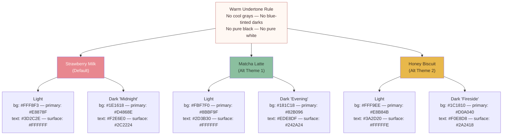

### Key Design Tokens

| Token | Value | Note |
|-------|-------|------|
| `--radius-button` | `9999px` (pill) | Squishy kawaii feel |
| `--radius-card` | `20px` | |
| `--radius-input` | `16px` | |
| `--radius-modal` | `24px` | Bottom sheet top corners |
| `--radius-small` | `8px–12px` | Tags, chips |
| `--shadow-elevated` | `0 8px 32px rgba(primary, 0.08)` | Warm-tinted, never `rgba(0,0,0,...)` |
| `--transition-interactive` | `200ms cubic-bezier(0.34, 1.56, 0.64, 1)` | Bouncy signature easing |
| `--transition-layout` | `300ms cubic-bezier(0.32, 0.72, 0, 1)` | |
| `--tab-bar-height` | `64px + safe-area-inset-bottom` | |
| `--touch-target-min` | `44×44px` | WCAG / Apple HIG minimum |
| `--content-padding` | `20px` | |

**Sources:** [B2] §Palettes, §Typography, §Components, §Anti-Slop Checklist, §Animation

---

## 4. Backend & Database

**Context:** The backend must support real-time sync between 2 users, scheduled jobs (sprint lifecycle, notifications), secure secret storage, and Edge Functions for AI integration — all without managing servers. The 2-user constraint means the entire system runs within Supabase's free tier or minimal paid plan.

### Decisions

| Decision | Alternatives Considered | Rationale | Status |
|----------|------------------------|-----------|--------|
| Supabase (PostgreSQL + Auth + Realtime + Edge Functions) | Firebase (Firestore + Cloud Functions), PlanetScale + Clerk + separate compute | PostgreSQL gives relational integrity, RLS, materialized views, pg_cron, and full SQL. Supabase bundles Auth, Realtime, Edge Functions, and Vault in one platform. Firebase rejected for NoSQL vendor lock-in and lack of Postgres features. [B4, B5] | Accepted |
| 14+ table schema | Fewer tables with JSONB blobs, document-oriented | Normalized schema enables RLS per table, efficient queries, and clear data boundaries. JSONB used only for flexible metadata fields (notification preferences, AI profile data). [B3, B5] | Accepted |
| Row Level Security on all tables | Application-level auth checks, no RLS | RLS is the only reliable way to prevent data leaks in a client-side app that talks directly to Postgres. Every table policy enforces `auth.uid()` matching. [B4] | Accepted |
| pg_cron for scheduling | External cron (GitHub Actions, Vercel Cron), polling from client | pg_cron runs inside the database — no external dependencies, no cold starts. Handles sprint lifecycle, notification scheduling, queue processing, materialized view refresh, and cleanup. [B5] | Accepted |
| Materialized views for AI context | Real-time computed views, application-level aggregation | `mv_user_mood_recent` (7-day avg, 30-day avg, trend, volatility) refreshed every 4 hours via pg_cron. Avoids expensive aggregation queries during AI context assembly. [B4] | Accepted |
| VAPID keys + all secrets in Supabase Vault | Environment variables, .env files, hardcoded | Vault provides encrypted at-rest storage accessible via `vault.decrypted_secrets`. VAPID keys, Anthropic API key, and service role key never appear in client code or Edge Function source. [B5] | Accepted |
| Email/password auth only | Social login (Google, Apple), magic links, passkeys | Two known users. Social login adds OAuth complexity for zero benefit. Email/password via Supabase Auth with JWT tokens. [B4] | Accepted |

### Core Database Schema (ER Diagram)

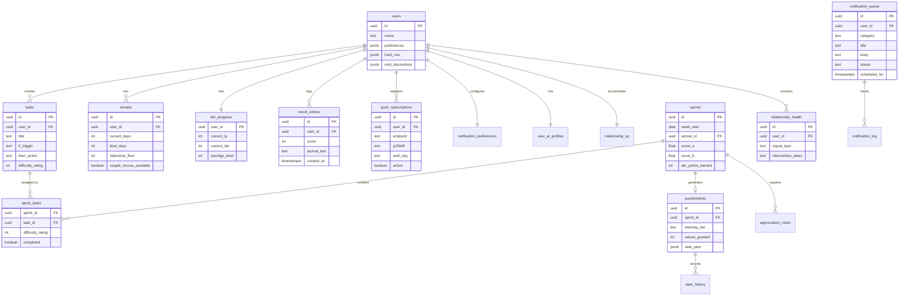

### Authentication Flow

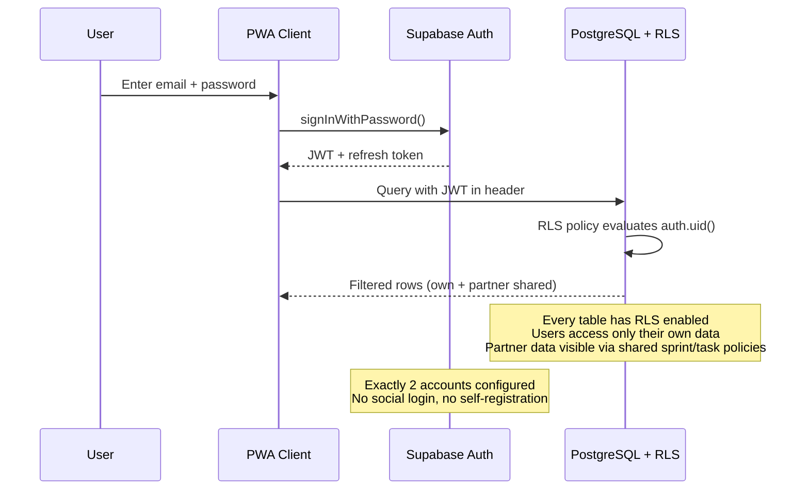

**Sources:** [B3] §Schema, [B4] §Context Assembly, §Database, [B5] §Notification Schema, §VAPID

---

## 5. AI Integration — Kira

**Context:** Kira is the AI judge, personality, and brain of the system — the "third member of the relationship." Rather than a generic chatbot, Kira is a character with consistent personality, moods, and cultural voice. The architecture separates deterministic mood selection (testable code) from generative expression (Claude's natural language), ensuring personality consistency while keeping costs under £4/month. [B4]

### Decisions

| Decision | Alternatives Considered | Rationale | Status |
|----------|------------------------|-----------|--------|
| Claude API via Edge Functions | OpenAI GPT, local LLM, no AI | Claude excels at personality consistency and nuanced reasoning. Edge Functions provide Deno runtime for direct API calls with no middleware. [B4, B6] | Accepted |
| 3-layer personality model (ALMA framework) | Single personality prompt, multiple AI agents, hard-coded responses | Layer 1 (Core Personality) is static — sharp, warm, occasionally savage. Layer 2 (Mood Modes) shifts based on context signals. Layer 3 (Emotion Overlay) reacts per-message and decays. This mirrors human emotional range — same person whether celebrating or disappointed. [B4] | Accepted |
| Deterministic mood selection (weighted algorithm) | LLM-driven mood selection, random, user-selected only | Five signals with fixed weights: task completion (30%), streak status (25%), mood check-in (20%), time of day (15%), day of week (10%). Runs as TypeScript in Edge Function, not in the LLM — testable, debuggable, predictable. [B4] | Accepted |
| Prompt caching (~1500 token system prompt) | No caching, full prompt every call | Anthropic's prompt caching with `cache_control: { type: 'ephemeral' }`. ~60% of input tokens cached per call. Effective input cost drops to ~$0.40/MTok blended (vs $1.00/MTok uncached). [B4] | Accepted |
| Model routing: Haiku 4.5 (routine) / Sonnet 4.5 (complex) | Single model for everything, Opus for all | Haiku for morning briefings, task suggestions, notifications, quick mood check-ins (~$0.001–0.004/call). Sonnet for sprint judging, date planning, excuse evaluation, deep mood check-ins (~$0.015–0.025/call). Start with Haiku for everything, upgrade specific functions only where quality difference justifies ~3x cost. [B4] | Accepted |
| 7 prompt templates per function | Single generic prompt, fully dynamic prompts | Sprint judging, date planning, task suggestion, excuse evaluation, mood check-in, notification copy, morning briefing — each with specific output format, constraints, and personality calibration. [B4] | Accepted |
| Hinglish cultural voice (max 3 phrases/interaction) | English only, full Hinglish, Hindi | Digital Hinglish as identity seasoning, not the main dish. Universal desi experiences (family dynamics, chai, Bollywood). Sheffield-aware. Gen Z internet-native. Inspired by Zomato/Swiggy push notification tone. Calibrate based on implicit user engagement feedback. [B4] | Accepted |
| £2–4/month budget target | No budget constraint, higher budget for quality | Estimated £1.20–3.20/month with prompt caching and batch API. Heavy usage stays under £5/month. Supabase free tier covers backend for 2 users. [B4] | Accepted |

### Mood Selection → Prompt Assembly → Response Pipeline

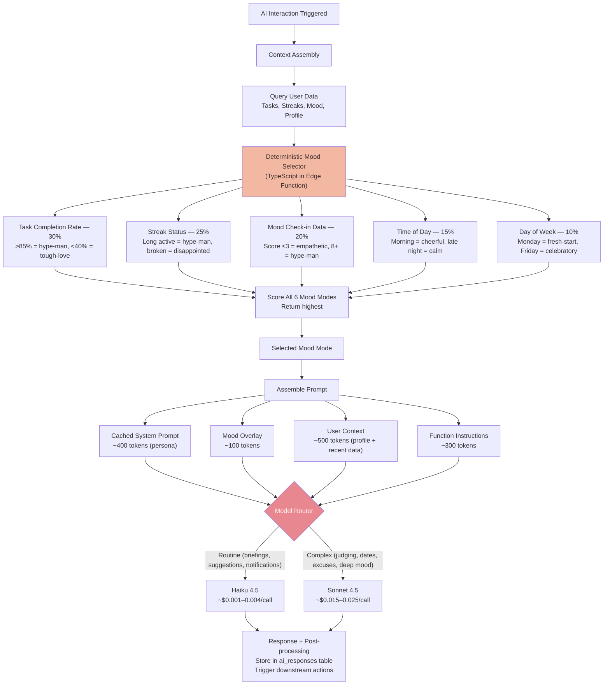

### Kira's Three-Layer Personality Model

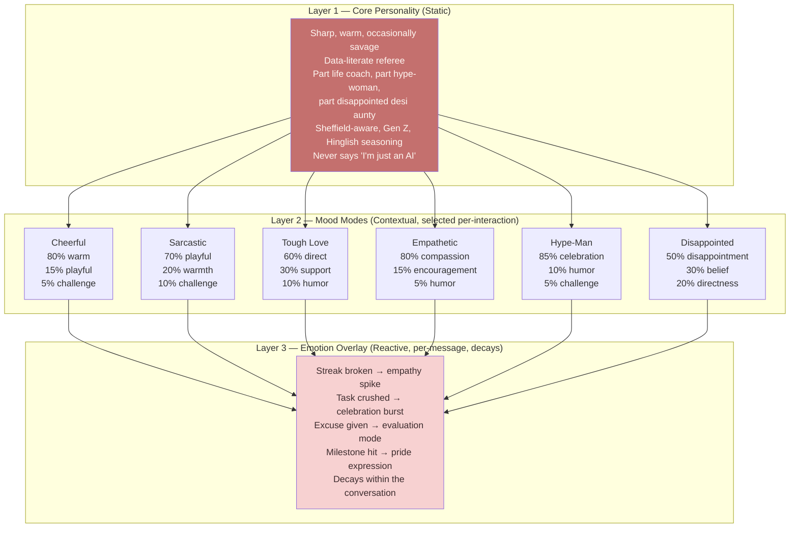

### Model Routing Reference

| Function | Model | Est. Cost/Call | Streaming | Frequency |
|----------|-------|---------------|-----------|-----------|
| Morning briefing | Haiku 4.5 | ~$0.004 | No (background) | Daily |
| Task suggestions | Haiku 4.5 | ~$0.003 | Yes (user-facing) | ~6/day |
| Notification copy | Haiku 4.5 | ~$0.001 | No (stored then pushed) | ~12/day |
| Mood check-in (quick) | Haiku 4.5 | ~$0.003 | Yes (interactive) | Daily |
| Mood check-in (deep) | Sonnet 4.5 | ~$0.015 | Yes (interactive) | ~1/week |
| Sprint judging | Sonnet 4.5 | ~$0.025 | No (background) | Weekly |
| Date planning | Sonnet 4.5 | ~$0.020 | Yes (fun to watch) | Weekly |
| Excuse evaluation | Sonnet 4.5 | ~$0.015 | No (quick classification) | ~1/day |

**Sources:** [B4] §Three-Layer Model, §Mood Selection, §Prompt Caching, §Model Routing, §Cost Estimates, §Cultural Voice

---

## 6. Gamification & Scoring

**Context:** The scoring system is the competitive engine that turns habit tracking into an accountability weapon. It must reward genuine effort, punish gaming, maintain streaks without "what the hell" abandonment, and progress users through feature-unlocking tiers. Every mechanic is calibrated against behavioral research to keep motivation high without triggering relationship damage. [B1, B3]

### Decisions

| Decision | Alternatives Considered | Rationale | Status |
|----------|------------------------|-----------|--------|
| Composite scoring: 30/20/30/15/5 weights | Simple win/loss, ELO rating, points-per-task | 30% completion + 20% difficulty + 30% consistency + 15% streak + 5% bonus. Reweighted from original 30/25/30/10/5 — difficulty reduced to limit gaming surface, streak increased to reward long-term commitment. ELO rejected: needs 30+ games for calibration, is zero-sum (breeds resentment), no anchor for 2 players. [B3] | Accepted |
| Hybrid difficulty rating (AI base ±1 user adjust) | Pure self-rating, pure AI rating | AI sets base difficulty 1–5, user adjusts ±1. Prevents self-serving inflation while respecting user knowledge of their own context. Anti-gaming decay: if >90% of tasks rated "Hard," effective difficulty decays (floor: 0.6x). [B3] | Accepted |
| 60% daily threshold for streaks | All-or-nothing (100%), no threshold | Calibrated to Fogg Behavior Model — low enough to survive bad days, avoiding the "what the hell" abandonment effect of all-or-nothing. E.g., 6 of 10 daily tasks maintains streak. [B3] | Accepted |
| Milestone floors for broken streaks | Reset to zero, keep full streak | Streak < 7: reset to 0. Streak 7–29: preserve 50%, 24h recovery. Streak ≥ 30: drop to previous milestone [3, 7, 14, 21, 30, 60, 90]. Best streak always tracked. [B3] | Accepted |
| 5-tier TP system (Seedling → Unshakeable) | Binary unlocked/locked, XP levels, no progression | Tier Points earned weekly (10–25 TP for score ≥70), with decay (−15 TP for score <40, additional for 3+ day inactivity). Features unlock at thresholds, creating intermediate goals. Max 1 tier drop per evaluation. [B3] | Accepted |
| Prestige system (opt-in reset from Tier 4) | No prestige, forced reset, unlimited progression | Unlocks after both partners sustain Tier 4 for 4 consecutive weeks. Opt-in reset to Tier 2 (not 0). Permanent badge + exclusive cosmetics + new AI personality. Each prestige level requires 10% more TP. Max 5 levels, then permanent "Legendary." [B3] | Accepted |
| Couple rescue mechanic | No rescue, automatic restoration | When a streak breaks, partner is notified and can complete a bonus task together to restore it. Turns frustration into cooperation. 1 rescue per week per partner cooldown. [B3] | Accepted |
| Ties = mutual wins | Tiebreaker metrics, coin flip | Ties are celebrated. If a tiebreaker is needed: highest difficulty attempted → better consistency → longer streak → declare mutual win (both plan a date). [B3] | Accepted |
| Relative Performance Index (not ELO) | ELO, raw win/loss record | Each player's score as percentage of combined total, rolling 4-week average. Tracks performance delta without zero-sum framing. [B3] | Accepted |

### Tier Progression

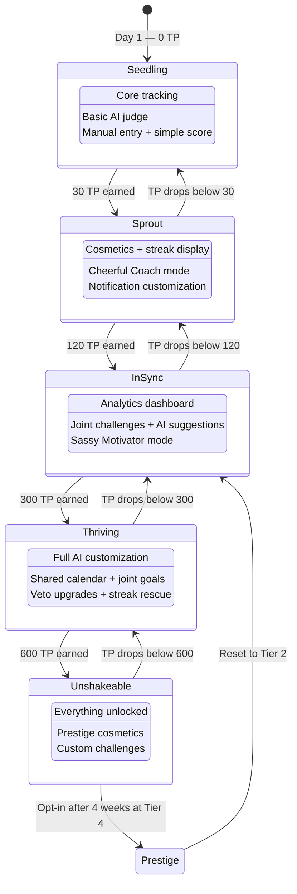

### Scoring Weights Breakdown

| Component | Weight | Formula | Anti-Gaming |
|-----------|--------|---------|-------------|
| Completion Rate | 30% | `(completed / assigned) × 100` | Straightforward, ungameable |
| Difficulty Score | 20% | Weighted sum (Trivial 0.5x → Brutal 2.5x) | Decay if >90% rated Hard: `max(0.6, 1.0 - (rate - 0.9) × 2)` |
| Consistency Score | 30% | `(1 - MAD / max_deviation) × 100` | Penalizes Sunday cramming, rewards daily spread |
| Streak Bonus | 15% | `min(25 × log(days) / log(30), 100)` | Logarithmic cap at 60 days prevents runaway |
| Bonus Points | 5% | Variable rewards: early_bird, perfect_day, etc. | Sum capped at 100 |

### TP Earning and Decay

| Condition | TP Change |
|-----------|-----------|
| Weekly score ≥ 70 | Earn `(score - 50) × 0.5` TP (10–25 TP) |
| Weekly score 40–69 | Earn `(score - 40) × 0.2` TP (0–6 TP) |
| Weekly score < 40 | Lose 15 TP |
| 3+ days inactivity | Additional `5 × (days_inactive - 2)` TP loss |
| Score 20–39 for 2+ weeks | "AT RISK" → lose 20 TP/week |
| Score < 20 or no activity | Lose 25 TP/week immediately |

**Sources:** [B1] §Variable Ratio Reinforcement, [B3] §Scoring, §Tiers, §Streaks, §Difficulty, §Anti-Gaming

---

## 7. Punishment Date Engine

**Context:** The punishment date system is the real-world consequence that makes the competition matter. The loser plans (or endures) an AI-generated date, with intensity scaling based on how badly they lost. The system must be fun, never cruel — even the loser ends up on a date. Hard personal boundaries are inviolable. The date memory algorithm ensures variety across an 8-week window. [B1, B3]

### Decisions

| Decision | Alternatives Considered | Rationale | Status |
|----------|------------------------|-----------|--------|
| 3-tier intensity (Mild / Moderate / Spicy) by margin | Fixed punishment regardless of margin, random intensity | Graduated sanctions per behavioral research. Mild (< 10 pt gap): playful, £20–30. Moderate (10–25 pt gap): 1–2 uncomfortable elements, £40–60. Spicy (> 25 pt gap): full AI control, £80–100. [B1, B3] | Accepted |
| 3-part date structure (activity + food + extras) | Single activity, unstructured budget | Primary activity (£20–50) + food/drink (£35–55) + extras (£5–15). Total within £100 budget. Structure ensures variety and peak moment engineering per Kahneman's peak-end rule. [B1, B3] | Accepted |
| Winner veto system scaled to performance | No vetoes, unlimited vetoes | Winner's completion %: 50–69% = 1 veto, 70–84% = 2 vetoes, 85–100% = 3 vetoes (near-total creative control). Additional vetoes unlock at Tier 3 (Thriving). [B3] | Accepted |
| 8-week non-repeat algorithm | No memory, simple random | `DateMemory` tracks venues, activity categories (physical/creative/food/cultural/outdoor), and cuisines. No venue repeat within 8 weeks. Category rotation ensures breadth. [B3] | Accepted |
| Hard nos vs mild discomforts (set during onboarding) | No preference system, binary safe/unsafe | Hard nos (phobias, dietary restrictions, accessibility): AI never crosses. Mild discomforts (things users find awkward but can handle): AI targets these at Moderate/Spicy intensity for growth. [B3] | Accepted |
| Wave intensity pattern | Automatic escalation, random | Mild → Moderate → Spicy → Mild cycle. Not automatic escalation — prevents the system from becoming progressively punitive. [B3] | Accepted |
| Mutual failure handling (both < 30%) | No special case, both punished | AI shifts to "disappointed parent" tone. Budget drops to £30 (forces creativity: Peak District picnic, free gallery + cheap pub). Collaborative redemption challenge (volunteer together, cook together). Uses "we" language exclusively. [B3] | Accepted |
| Post-date ratings with quality safeguard | No ratings, rating without consequences | Both partners rate 1–5 after each date. If ratings dip below 3/5 twice consecutively, AI immediately pulls back intensity. Rating of 1/5 triggers immediate downshift to Mild. [B3] | Accepted |

### Date Engine Pipeline

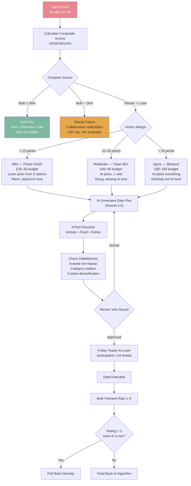

**Sources:** [B1] §Peak-End Rule, §Graduated Sanctions, [B3] §Punishment Dates, §Veto System, §Date Memory, §Mutual Failure

---

## 8. Psychology & Safety

**Context:** The app deploys psychological manipulation techniques — with user consent and full transparency. Six validated engines drive engagement, while 10 "dark patterns deployed for good" create urgency and commitment. The critical constraint: the app must never become a source of relationship damage. Gottman's 5:1 positive-to-negative ratio is a hard engineering requirement, not a guideline. The RelationshipHealthMonitor detects warning signals and intervenes automatically. [B1, B3]

### Decisions

| Decision | Alternatives Considered | Rationale | Status |
|----------|------------------------|-----------|--------|
| 6 psychological engines | No psychology framework, standard gamification only | Variable ratio reinforcement, loss aversion, Zeigarnik effect, social comparison (N-effect), implementation intentions (d=0.65 effect size), fresh start effect (33.4% Monday boost). Each individually validated; synergistically powerful when combined. [B1] | Accepted |
| 10 dark patterns (benevolent, opt-in) | No dark patterns (rejected: engagement too low), unguarded dark patterns (rejected: manipulative) | Decaying point bank, mutual streak hostage, endowed Monday head start, variable reward mystery box, competitive push notifications, sunk cost relationship timeline, tomorrow teaser, shame-free public commitment, AI date uncertainty engine, "both win" escape valve. All transparent — users understand the mechanics. [B1] | Accepted |
| Gottman's 5:1 ratio as hard constraint | Soft guideline, no ratio tracking | System tracks positive vs negative interactions per partner. For every competitive/negative message, at least 5 positive/supportive ones. Auto-injects celebrations if ratio drops. This is enforced in code, not advisory. [B1, B3] | Accepted |
| RelationshipHealthMonitor with automated interventions | Manual monitoring, no safety system | 6 signal types: sustained losing (3+ weeks), disengagement (< 3 opens/week), score disparity (> 30% gap for 2+ weeks), low date satisfaction (< 3 rating twice), one-sided activity (5+ days), rage-quit pattern (close app within 10s of score reveal). Automated responses escalate from passive to structural. [B3] | Accepted |
| 3-tier catch-up mechanics ("Mario Kart rubber-banding") | No catch-up (rejected: demoralizing), heavy catch-up (rejected: undermines competition) | Tier 1 (Passive, always active): 1.15x comeback multiplier, improvement bonus. Tier 2 (Active, after 3-week losing streak): challenge mode, wildcard habits. Tier 3 (Structural, after 5-week losing streak): fresh start week, swap week, collaborative sprint. Catch-up cannot flip a >25% margin into a win. [B3] | Accepted |
| Mandatory grace periods and opt-out | No pause option, competition always on | Either partner can instantly pause competitive features — no explanation required, no guilt. Life events (illness, travel, exams) trigger automatic grace with no TP decay. One free week per month where competition pauses. [B1, B3] | Accepted |
| No lifetime win-loss records | Full historical records | Lifetime records are a "contempt factory." Timeline celebrates total shared growth: "Together: 22 weeks of growth, 650 habits completed, 12 dates experienced." Relationship XP counter never resets. [B1] | Accepted |
| Score gap circuit breaker | No automatic intervention | If one partner leads by >40% for 2 consecutive weeks, auto-switch to team mode for 1 week. Based on Kohler effect research: motivation collapses beyond ~40% ability discrepancy. [B1] | Accepted |

### Relationship Health Monitor

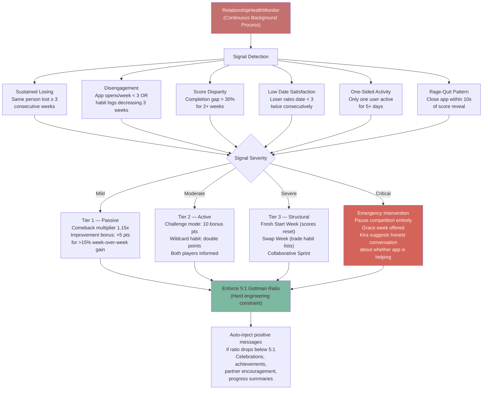

### Mercy Rules Quick Reference

| Condition | Response |
|-----------|----------|
| Weeks 1–2 of app usage | No punishment dates ("training wheels" mode) |
| Same person loses 3 consecutive weeks | One collaborative sprint replaces competition |
| Either user's completion < 20% for 2+ weeks | Pause competition entirely; encouragement mode |
| Completion gap exceeds 40% | Dynamic difficulty adjustment (harder for leader, easier for trailing) |
| Post-date satisfaction < 3/5 twice | Reduce punishment intensity + in-app couples check-in |
| Date rating is 1/5 | Immediate downshift to Mild; couples check-in triggered |
| Engagement drop > 50% week-over-week | "Relationship temperature check" prompt |

**Sources:** [B1] §Six Engines, §Dark Patterns, §Gottman's Ratio, §Graduated Sanctions, [B3] §Catch-Up, §Mercy Rules, §Health Monitor

---

## 9. Push Notifications

**Context:** Push notifications are the primary "pinch" mechanism — the thing that forces users to open the app. The system uses Web Push (RFC 8292/8291) via Supabase Edge Functions, with @negrel/webpush for Deno compatibility. iOS requires PWA installation to home screen before push works, and offers only one permission prompt — making the pre-permission flow critical. The notification schedule covers 7 types, with deadline escalation through 7 urgency steps. [B5]

### Decisions

| Decision | Alternatives Considered | Rationale | Status |
|----------|------------------------|-----------|--------|
| Web Push (RFC 8292/8291) via Edge Functions | Firebase Cloud Messaging (rejected: vendor lock-in), polling (rejected: battery drain), email fallback (rejected: low engagement) | Standards-based, works across Chrome/Firefox/Safari. VAPID signing (P-256 ECDSA) + aes128gcm payload encryption. No FCM dependency. [B5] | Accepted |
| @negrel/webpush for Deno | web-push (Node.js), custom implementation | Standard Node.js `web-push` doesn't work on Deno (Supabase Edge Functions runtime). `@negrel/webpush` from JSR uses pure Web APIs, designed for edge runtimes. [B5] | Accepted |
| 5-table notification schema | Single queue table, application-level scheduling | `push_subscriptions`, `notification_templates`, `notification_queue`, `notification_log`, `notification_preferences`. Separation of concerns enables RLS, granular preferences, audit trail, and template reuse. [B5] | Accepted |
| pg_cron for scheduling (4 jobs) | External cron, client-side polling | Queue processor (every minute), retry handler (every 5 min), daily scheduler (9:15 AM UTC), weekly cleanup (Sunday 3 AM). All run inside the database — no external dependencies. [B5] | Accepted |
| 7-step deadline escalation | Single reminder, 3-step | 1 week → 3 days → 1 day → 4 hours → 1 hour → 30 min → OVERDUE. Each step replaces the previous (same `tag`), preventing notification pile-up. Language becomes progressively more partner-referencing. [B5] | Accepted |
| Active hours: 9 AM – 1 AM UK | 24/7, app-defined only | Matches founders' sleep schedule (12–1 AM to 9–10 AM). Double-enforced: scheduler filters before insert, Edge Function checks before send. Users can override with custom sleep window. [B5] | Accepted |
| 8/day hard cap (configurable 3–10) | No cap, soft cap only | `BEFORE INSERT` trigger on `notification_queue` checks daily count. Non-high-urgency auto-cancelled if cap reached. High-urgency can exceed cap. Minimum 2-hour gap between notifications (except high-urgency/nudges). [B5] | Accepted |
| Event-driven partner notifications via DB trigger | Polling, client-initiated | `AFTER UPDATE` trigger on `habit_completions` inserts partner notification into queue when a task is completed. Checks quiet hours before inserting. [B5] | Accepted |
| Supabase Realtime as secondary channel | Realtime only (rejected: background delivery), push only (rejected: delayed when app open) | When app is open in foreground, Realtime delivers instant in-app updates. Push handles background delivery. React hook subscribes to `notification_queue` INSERT events filtered by user_id. [B5] | Accepted |
| iOS pre-permission flow (in-app dialog first) | Direct system prompt, no explanation | iOS allows only one permission ask. A custom in-app dialog explains the value (partner accountability, deadline reminders, streak protection) and promises 2–3 notifications/day, never during sleep. "Add to Home Screen" gate must come first — push subscription silently fails if PWA not installed. [B5] | Accepted |
| AI-generated notification copy (Haiku 4.5) | Static templates only, Sonnet for copy | Behavioral psychology techniques per notification: loss aversion, curiosity gap, progress anchoring, identity reinforcement. Max 60 chars title, 120 chars body, max 1 emoji. Haiku keeps costs under $0.001/notification. [B4, B5] | Accepted |
| Graceful exit sequence (Duolingo-inspired) | Keep sending forever, abrupt stop | Days 1–3 missed: "Your habits are waiting." Days 4–7: "Your streak is fading." Days 8–14: "Partner hasn't heard from you." Day 15+: "We'll pause reminders." Then silence. Cessation message itself drives a 3% retention lift. [B5] | Accepted |

### Push Notification Delivery Pipeline

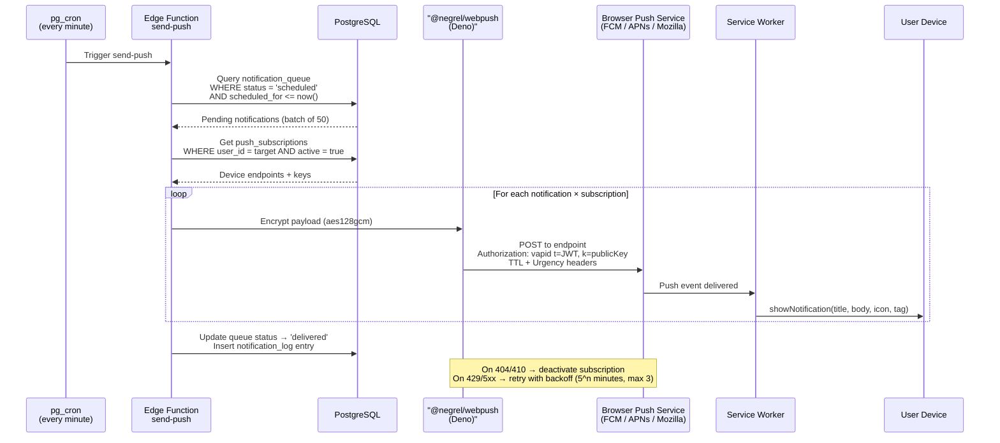

### Notification Schedule

| Time (UK) | Type | Tag | Urgency | Trigger |
|-----------|------|-----|---------|---------|
| 09:30 Mon | Sprint start | `sprint-start` | Normal | Weekly cron |
| 09:30 daily | Morning briefing | `morning-briefing` | Normal | Daily cron |
| Variable | Deadline escalation (7 steps) | `deadline-{taskId}` | Low → High | Scheduler |
| Real-time | Partner completed habit | `partner-activity` | Normal | DB trigger |
| 20:00 | Streak warning | `streak-warning` | High | Daily checker |
| 22:00 Sun | Sprint results | `sprint-results` | Normal | Weekly cron |
| 23:30 | Mood check-in | `mood-checkin` | Low | Daily cron |

**Sources:** [B5] §Web Push Architecture, §VAPID, §@negrel/webpush, §Edge Functions, §pg_cron, §iOS Limitations, §Deadline Escalation, §Throttling, [B4] §Notification Copy

---

## 10. Onboarding & Mascot

**Context:** The onboarding flow is the first emotional experience with the app. Inspired by Finch's 18-step journey (which achieved 4.95 stars from 550K+ reviews), the flow must take both partners from zero to their first sprint in under 10 minutes. The shared mascot (Mochi) is a bonding mechanism — both partners hatch, name, and care for it together. The mascot never punishes; Kira delivers accountability. [B2, B4, B6]

### Decisions

| Decision | Alternatives Considered | Rationale | Status |
|----------|------------------------|-----------|--------|
| Shared mascot (Mochi), not two separate | Two individual mascots, no mascot | One creature both partners care for together. Joint achievements unlock shared cosmetics. Strengthens "we" identity. Two mascots would create parallel individual experiences instead of a shared bond. [B2] | Accepted |
| 5+ expression states, never punishing | Full emotion range including angry/punishing | Happy/default, excited/celebrating, sleepy/cozy, concerned/encouraging, excited/milestone. Never punishing or angry — Kira delivers accountability, mascot stays gentle. This is a hard design rule. [B2] | Accepted |
| Egg hatching ceremony (both present) | Instant mascot reveal, gradual appearance | Both partners must be present (online) to hatch. Creates a shared first moment and ritual. The egg itself is a Zeigarnik open loop during onboarding. [B2] | Accepted |
| 18-step emotional onboarding (4 phases) | Tutorial overlay, skip-to-app, minimal setup | Phase 1: Welcome (3 steps). Phase 2: Pairing (2 steps). Phase 3: Bonding (5 steps — egg, hatching, naming, goals). Phase 4: Setup (8 steps — Kira intro, notifications, first sprint, home screen). Inspired by Finch. [B2] | Accepted |
| Mascot growth stages tied to couple progress | Static mascot, individual mascot growth | Visible evolution based on collective habits. Reflects the couple's combined status on the home screen. Creates long-term visual progression that complements Tier Points. [B2] | Accepted |
| Collectible outfits earned through joint consistency | Purchasable cosmetics, no customization | Outfits earned by joint milestones, not purchased. Avoids exploitative gem economy (Habitica's failure mode per [B6]). Prestige cosmetics exclusive to Prestige tier. [B2, B3, B6] | Accepted |
| Day 1 counts as Day 1 of streak (endowed progress) | Start at Day 0, start counting after first completion | Nunes & Dreze (2006): pre-filled progress cards completed at 34% vs 19% (nearly double). Signup day counts as Day 1, giving users the "already started" feeling. [B1, B3] | Accepted |
| iOS pre-permission before system prompt | Direct system prompt, skip permission | iOS allows one ask. Custom in-app dialog explains value before triggering the native prompt. "Add to Home Screen" must come before notification permission — push silently fails without PWA installation. [B5] | Accepted |

### 18-Step Onboarding Journey

```mermaid
flowchart LR
    subgraph "Phase 1 — Welcome"
        S1["1. Welcome<br/>Screen"] --> S2["2. Concept<br/>'You two vs.<br/>your worst habits'"]
        S2 --> S3["3. Set<br/>Expectations"]
    end

    subgraph "Phase 2 — Pairing"
        S3 --> S4["4. Partner<br/>Invite Code"]
        S4 --> S5["5. Partner<br/>Joins"]
    end

    subgraph "Phase 3 — Bonding"
        S5 --> S6["6. Egg<br/>Selection"]
        S6 --> S7["7. Hatching<br/>Ceremony<br/>(both present)"]
        S7 --> S8["8. Name<br/>Your Mascot"]
        S8 --> S9["9. Individual<br/>Goal Setting"]
        S9 --> S10["10. Partner<br/>Goals"]
    end

    subgraph "Phase 4 — Setup"
        S10 --> S11["11. Meet Kira<br/>(personality preview)"]
        S11 --> S12["12. Kira Tone<br/>Selection"]
        S12 --> S13["13. (iOS) Add to<br/>Home Screen"]
        S13 --> S14["14. Pre-Permission<br/>Dialog"]
        S14 --> S15["15. System<br/>Notification<br/>Prompt"]
        S15 --> S16["16. First Sprint<br/>Setup"]
        S16 --> S17["17. AI Suggests<br/>Initial Goals"]
        S17 --> S18["18. Launch!<br/>Day 1 = Streak Day 1"]
    end

    style S7 fill:#E8878F,color:#FFF8F3
    style S18 fill:#7DB8A0,color:#3D2C2E
```

### Mascot Specifications

| Property | Value | Source |
|----------|-------|-------|
| Species | Mochi (custom creature, not cat/bird/owl) | [B2] — avoids Hello Kitty, Finch, Duolingo overlap |
| Head-to-body ratio | 2.5:1 to 3:1 | [B2] |
| Eye placement | Simple dots in lower 40% of head | [B2] |
| Line weight | Consistent 2.5–3px | [B2] |
| Max colors | 5–6 with exact hex codes | [B2] |
| UI sizing | 48–80px in nav, up to 200px for celebrations | [B2] |
| Idle animation | Gentle floating, 3s ease-in-out, 2–5px vertical bob, blink every 3–4s | [B2] |
| Expression states | Happy, excited, sleepy, encouraging, milestone — never punishing | [B2] |
| Current assets | 2 of 5+ states done (Idle, Happy Bounce) — see `image/mochi.png` | Roadmap |

**Sources:** [B1] §Endowed Progress, [B2] §Mascot, §Onboarding, [B5] §iOS Pre-Permission, [B6] §Finch Analysis, §Habitica Cosmetics

---

## Appendix A: Decision Index

Quick-reference table of all decisions with section links.

| # | Decision | Section | Sources |
|---|----------|---------|---------|
| 1 | PWA (not native) | [1. System Architecture](#1-system-architecture-overview) | B5, B6 |
| 2 | Supabase as sole backend | [1. System Architecture](#1-system-architecture-overview) | B4, B5 |
| 3 | 2-user hard constraint | [1. System Architecture](#1-system-architecture-overview) | B1, B6 |
| 4 | Claude API for AI | [1. System Architecture](#1-system-architecture-overview) | B4, B6 |
| 5 | React + Vite | [2. Frontend Stack](#2-frontend-stack) | B6 |
| 6 | Tailwind CSS v4 | [2. Frontend Stack](#2-frontend-stack) | B2 |
| 7 | vite-plugin-pwa | [2. Frontend Stack](#2-frontend-stack) | B5 |
| 8 | Self-hosted fonts (@fontsource-variable) | [2. Frontend Stack](#2-frontend-stack) | B2 |
| 9 | Baloo 2 + Nunito + Comfortaa | [2. Frontend Stack](#2-frontend-stack) | B2 |
| 10 | dotLottie + @lottiefiles/dotlottie-react | [2. Frontend Stack](#2-frontend-stack) | B2 |
| 11 | Hugeicons (Stroke Rounded) | [2. Frontend Stack](#2-frontend-stack) | B2 |
| 12 | Dark mode (prefers-color-scheme + toggle) | [2. Frontend Stack](#2-frontend-stack) | B2 |
| 13 | Banned font list | [2. Frontend Stack](#2-frontend-stack) | B2 |
| 14 | 3 warm palettes (Strawberry Milk default) | [3. Design System](#3-design-system) | B2 |
| 15 | 18-point anti-slop checklist | [3. Design System](#3-design-system) | B2 |
| 16 | Kawaii "Pastel Kawaii" sub-genre | [3. Design System](#3-design-system) | B2 |
| 17 | Bouncy easing signature | [3. Design System](#3-design-system) | B2 |
| 18 | Pixel-level component specs | [3. Design System](#3-design-system) | B2 |
| 19 | Major Third typographic scale | [3. Design System](#3-design-system) | B2 |
| 20 | prefers-contrast: more support | [3. Design System](#3-design-system) | B2 |
| 21 | PostgreSQL + RLS on all tables | [4. Backend & Database](#4-backend--database) | B4 |
| 22 | 14+ table normalized schema | [4. Backend & Database](#4-backend--database) | B3, B5 |
| 23 | pg_cron for scheduling | [4. Backend & Database](#4-backend--database) | B5 |
| 24 | Materialized views for AI context | [4. Backend & Database](#4-backend--database) | B4 |
| 25 | Secrets in Supabase Vault | [4. Backend & Database](#4-backend--database) | B5 |
| 26 | Email/password auth only | [4. Backend & Database](#4-backend--database) | B4 |
| 27 | Claude API via Edge Functions | [5. AI Integration](#5-ai-integration--kira) | B4, B6 |
| 28 | 3-layer personality model (ALMA) | [5. AI Integration](#5-ai-integration--kira) | B4 |
| 29 | Deterministic mood selection (5 weights) | [5. AI Integration](#5-ai-integration--kira) | B4 |
| 30 | Prompt caching (~1500 tokens) | [5. AI Integration](#5-ai-integration--kira) | B4 |
| 31 | Model routing (Haiku / Sonnet) | [5. AI Integration](#5-ai-integration--kira) | B4 |
| 32 | 7 prompt templates | [5. AI Integration](#5-ai-integration--kira) | B4 |
| 33 | Hinglish cultural voice (max 3/interaction) | [5. AI Integration](#5-ai-integration--kira) | B4 |
| 34 | £2–4/month AI budget target | [5. AI Integration](#5-ai-integration--kira) | B4 |
| 35 | Composite scoring 30/20/30/15/5 | [6. Gamification](#6-gamification--scoring) | B3 |
| 36 | Hybrid difficulty rating (AI ±1) | [6. Gamification](#6-gamification--scoring) | B3 |
| 37 | 60% daily streak threshold | [6. Gamification](#6-gamification--scoring) | B3 |
| 38 | Milestone floors for broken streaks | [6. Gamification](#6-gamification--scoring) | B3 |
| 39 | 5-tier TP system | [6. Gamification](#6-gamification--scoring) | B3 |
| 40 | Prestige system (opt-in reset) | [6. Gamification](#6-gamification--scoring) | B3 |
| 41 | Couple rescue mechanic | [6. Gamification](#6-gamification--scoring) | B3 |
| 42 | Ties = mutual wins | [6. Gamification](#6-gamification--scoring) | B3 |
| 43 | Relative Performance Index | [6. Gamification](#6-gamification--scoring) | B3 |
| 44 | 3-tier punishment intensity | [7. Punishment Dates](#7-punishment-date-engine) | B1, B3 |
| 45 | 3-part date structure | [7. Punishment Dates](#7-punishment-date-engine) | B1, B3 |
| 46 | Winner veto system (scaled) | [7. Punishment Dates](#7-punishment-date-engine) | B3 |
| 47 | 8-week non-repeat algorithm | [7. Punishment Dates](#7-punishment-date-engine) | B3 |
| 48 | Hard nos vs mild discomforts | [7. Punishment Dates](#7-punishment-date-engine) | B3 |
| 49 | Wave intensity pattern | [7. Punishment Dates](#7-punishment-date-engine) | B3 |
| 50 | Mutual failure handling | [7. Punishment Dates](#7-punishment-date-engine) | B3 |
| 51 | Post-date ratings + quality safeguard | [7. Punishment Dates](#7-punishment-date-engine) | B3 |
| 52 | 6 psychological engines | [8. Psychology & Safety](#8-psychology--safety) | B1 |
| 53 | 10 benevolent dark patterns | [8. Psychology & Safety](#8-psychology--safety) | B1 |
| 54 | Gottman's 5:1 ratio (hard constraint) | [8. Psychology & Safety](#8-psychology--safety) | B1, B3 |
| 55 | RelationshipHealthMonitor (6 signals) | [8. Psychology & Safety](#8-psychology--safety) | B3 |
| 56 | 3-tier catch-up mechanics | [8. Psychology & Safety](#8-psychology--safety) | B3 |
| 57 | Grace periods + opt-out without shame | [8. Psychology & Safety](#8-psychology--safety) | B1, B3 |
| 58 | No lifetime win-loss records | [8. Psychology & Safety](#8-psychology--safety) | B1 |
| 59 | Score gap circuit breaker (>40% for 2 weeks) | [8. Psychology & Safety](#8-psychology--safety) | B1 |
| 60 | Web Push via Edge Functions | [9. Push Notifications](#9-push-notifications) | B5 |
| 61 | @negrel/webpush for Deno | [9. Push Notifications](#9-push-notifications) | B5 |
| 62 | 5-table notification schema | [9. Push Notifications](#9-push-notifications) | B5 |
| 63 | pg_cron (4 notification jobs) | [9. Push Notifications](#9-push-notifications) | B5 |
| 64 | 7-step deadline escalation | [9. Push Notifications](#9-push-notifications) | B5 |
| 65 | Active hours 9 AM – 1 AM | [9. Push Notifications](#9-push-notifications) | B5 |
| 66 | 8/day notification cap | [9. Push Notifications](#9-push-notifications) | B5 |
| 67 | Event-driven partner notifications | [9. Push Notifications](#9-push-notifications) | B5 |
| 68 | Realtime as secondary channel | [9. Push Notifications](#9-push-notifications) | B5 |
| 69 | iOS pre-permission flow | [9. Push Notifications](#9-push-notifications) | B5 |
| 70 | AI-generated notification copy | [9. Push Notifications](#9-push-notifications) | B4, B5 |
| 71 | Graceful exit sequence | [9. Push Notifications](#9-push-notifications) | B5 |
| 72 | Shared mascot (Mochi) | [10. Onboarding & Mascot](#10-onboarding--mascot) | B2 |
| 73 | 5+ expression states, never punishing | [10. Onboarding & Mascot](#10-onboarding--mascot) | B2 |
| 74 | Egg hatching ceremony | [10. Onboarding & Mascot](#10-onboarding--mascot) | B2 |
| 75 | 18-step emotional onboarding | [10. Onboarding & Mascot](#10-onboarding--mascot) | B2 |
| 76 | Mascot growth stages | [10. Onboarding & Mascot](#10-onboarding--mascot) | B2 |
| 77 | Collectible outfits (earned, not purchased) | [10. Onboarding & Mascot](#10-onboarding--mascot) | B2, B3, B6 |
| 78 | Endowed progress (Day 1 = Day 1) | [10. Onboarding & Mascot](#10-onboarding--mascot) | B1, B3 |
| 79 | iOS pre-permission before system prompt | [10. Onboarding & Mascot](#10-onboarding--mascot) | B5 |

---

## Appendix B: Research Brief Cross-Reference

Maps each research brief to the decisions it informed.

| Brief | Domain | Decisions Informed |
|-------|--------|-------------------|
| **[B1]** Psychology | 2-user constraint (#3), 6 psychological engines (#52), 10 dark patterns (#53), Gottman's 5:1 (#54), grace periods (#57), no lifetime records (#58), circuit breaker (#59), 3-tier intensity (#44), 3-part date (#45), endowed progress (#78) |
| **[B2]** Design | Tailwind v4 (#6), fonts (#8, #9), Lottie (#10), Hugeicons (#11), dark mode (#12), banned fonts (#13), palettes (#14), anti-slop (#15), kawaii (#16), bouncy easing (#17), components (#18), type scale (#19), contrast (#20), mascot (#72, #73), onboarding (#75), growth stages (#76) |
| **[B3]** Gamification | Schema (#22), scoring (#35), difficulty (#36), streaks (#37, #38), tiers (#39), prestige (#40), rescue (#41), ties (#42), RPI (#43), punishment tiers (#44), veto (#46), date memory (#47), hard nos (#48), wave pattern (#49), mutual failure (#50), ratings (#51), health monitor (#55), catch-up (#56), grace periods (#57), outfits (#77), endowed progress (#78) |
| **[B4]** AI/Kira | Supabase (#2), Claude API (#4, #27), 3-layer model (#28), mood selection (#29), prompt caching (#30), model routing (#31), templates (#32), Hinglish (#33), budget (#34), materialized views (#24), auth (#26), notification copy (#70) |
| **[B5]** Notifications | PWA (#1), vite-plugin-pwa (#7), Vault (#25), pg_cron (#23, #63), Web Push (#60), @negrel/webpush (#61), schema (#62), escalation (#64), active hours (#65), cap (#66), partner triggers (#67), Realtime (#68), iOS pre-permission (#69, #79), exit sequence (#71) |
| **[B6]** Competitive Analysis | React + Vite (#5), 2-user constraint (#3), Claude API (#4), outfits model (#77) |

---

## Appendix C: Glossary

| Term | Definition |
|------|-----------|
| **ADR** | Architecture Decision Record — this document |
| **ALMA** | A Layered Model of Affect — framework for Kira's 3-layer personality |
| **EF** | Edge Functions — Supabase's serverless Deno runtime |
| **JWT** | JSON Web Token — authentication token issued by Supabase Auth |
| **MAD** | Mean Absolute Deviation — used in consistency scoring |
| **N-effect** | Garcia & Tor (2009): competitive motivation peaks with fewer competitors (2 = optimal) |
| **PWA** | Progressive Web App — installable web app with push notifications and offline support |
| **RLS** | Row Level Security — PostgreSQL feature enforcing per-user data access |
| **RPI** | Relative Performance Index — each player's score as % of combined total |
| **SW** | Service Worker — browser background thread for push and caching |
| **TP** | Tier Points — progression currency earned/lost weekly |
| **VAPID** | Voluntary Application Server Identification — Web Push signing standard (RFC 8292) |
| **VR schedule** | Variable Ratio reinforcement — random reward schedule (Skinner) |

---

*This ADR is a living document. Update as development progresses and decisions evolve.*
